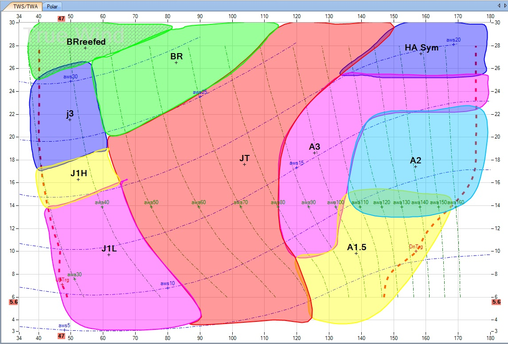

# Crossover Chart

An interactive sail performance matrix for visualising **when to use each sail** based on True Wind Angle (TWA) and True Wind Speed (TWS).



---

## What is a crossover chart?

A crossover chart maps each sail's usable wind range as a region on a two-axis grid:

- **X axis** — True Wind Angle (TWA) from 30 ° to 160 °
- **Y axis** — True Wind Speed (TWS) from 0 to 30 knots

Where regions overlap, you can choose between sails. The boundaries of those overlaps are the **crossover points** — the exact conditions where you'd typically gybe or change sail.

---

## Getting started

### Run locally

```bash
npm install
npm run dev
```

Open `http://localhost:5173` in your browser.

### Deploy to GitHub Pages

1. Push this repository to GitHub.
2. Go to **Settings → Pages** and set the source to the `main` branch, root (`/`).
3. The site is served directly — no build step required.

> **Note:** The app uses native ES modules (`type="module"`), which require a proper HTTP server (not `file://`). Use `npm run dev` locally, or any static host for production.

---

## Usage

### Editing sails

| Action | How |
|---|---|
| Select a sail | Click its region on the chart or its name in the sidebar |
| Move a region | Select it, then drag anywhere inside it |
| Reshape a region | Select it, then drag any white control point handle |
| Add a control point | Switch to **+ Point** mode, click near the edge you want to subdivide |
| Delete a control point | Switch to **− Remove** mode, click the red handle to remove |
| Edit name / colour / opacity | Select a sail — the editor panel opens in the sidebar |
| Delete a sail | Select it, click **Delete Sail** in the editor, or press `Delete` |

### Keyboard shortcuts

| Key | Action |
|---|---|
| `V` | Select mode |
| `A` | Add point mode |
| `D` | Remove point mode |
| `Delete` / `Backspace` | Delete selected sail |
| `Escape` | Deselect |
| `Ctrl Z` | Undo (up to 60 steps) |
| `Ctrl Y` / `Ctrl Shift Z` | Redo |

### Saving and loading

| Button | Action |
|---|---|
| **Save XML** | Download the chart as an XML file |
| **Load XML** | Open a previously saved XML file |
| **Export PNG** | Download the chart as a flat PNG image |
| **Print** | Print the chart area only (sidebar/toolbar hidden) |

Changes are automatically saved to your browser's local storage — your work persists across page refreshes.

---

## Adding a new sail

1. Click **+ Add Sail** in the header.
2. Enter a name, pick a colour, and set the approximate angle/speed for its centre point.
3. Click **Add Sail** — an oval region is created.
4. Select it and use **+ Point** mode to add more handles, then drag them to sculpt the exact shape.

---

## File structure

```
index.html          — HTML entry point
css/
  style.css         — design system (nautical dark theme)
js/
  sails.js          — SailStore: data model, undo/redo, localStorage, XML import/export
  chart.js          — ChartRenderer: canvas drawing, hit testing, coordinate transforms
  app.js            — UI logic: pointer events, mode switching, toolbar, modal
package.json        — dev server (Vite)
```

---

## XML format

The saved file is human-readable and portable:

```xml
<?xml version="1.0" encoding="UTF-8"?>
<CrossoverChart>
  <Sail name="J1" color="#ff9500" opacity="0.55" visible="true"
        points="107.000,11.000 96.380,14.536 72.000,16.000 …"/>
</CrossoverChart>
```

Each `points` value is a space-separated list of `angle,speed` pairs defining the Catmull-Rom spline control points.

---

## Tech stack

- Vanilla JavaScript (ES modules, no framework)
- HTML5 Canvas (two-layer: static grid + interactive sails)
- CSS custom properties
- [Vite](https://vite.dev) for local development

Fonts: [Cormorant Garamond](https://fonts.google.com/specimen/Cormorant+Garamond) · [Azeret Mono](https://fonts.google.com/specimen/Azeret+Mono) · [Outfit](https://fonts.google.com/specimen/Outfit)
