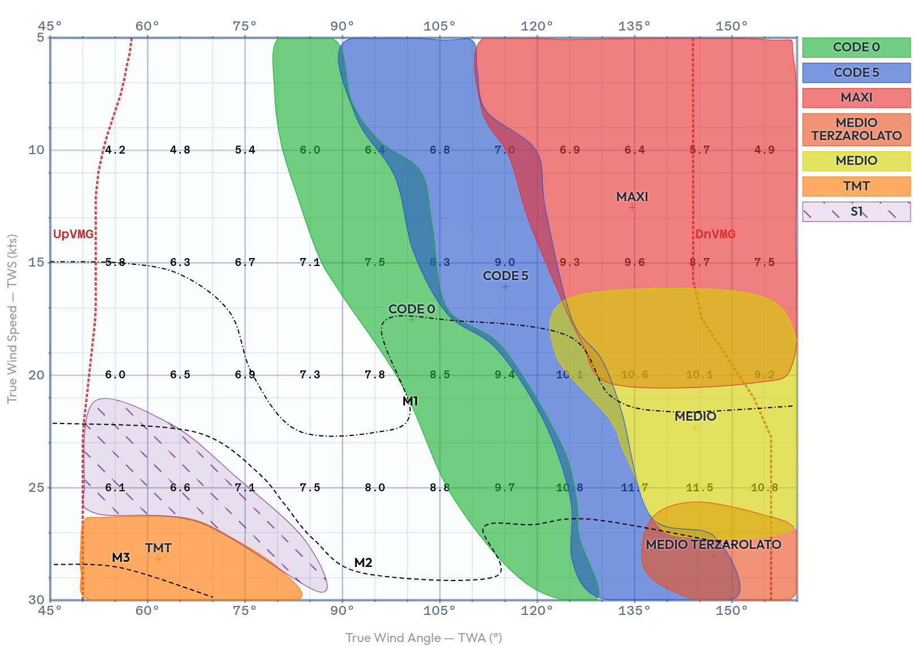

# Sail Chart

**Live app: [https://leonardogeminiani.github.io/SailChartMaker/](https://leonardogeminiani.github.io/SailChartMaker/)**

An interactive sail performance matrix for visualising **when to use each sail** based on True Wind Angle (TWA) and True Wind Speed (TWS).



A sail chart maps each sail's usable wind range as a region on a two-axis grid — TWA on the X axis, TWS on the Y axis. Where regions overlap you can choose between sails; the boundaries of those overlaps are the **crossover points**, the exact conditions where you'd typically gybe or change sail.

---

## Install and run (development)

```bash
npm install
npm run dev
```

Open `http://localhost:5173` in your browser.

### Deploy to GitHub Pages

1. Push this repository to GitHub.
2. Go to **Settings → Pages** and set the source to the `main` branch, root (`/`).
3. The site is served directly — no build step required.

> **Note:** The app uses native ES modules (`type="module"`), which require a proper HTTP server (not `file://`). Use `npm run dev` locally, or any static host for production.

---

## Desktop app (Electron)

A downloadable desktop build is available on the [Releases](https://github.com/leonardogeminiani/SailChartMaker/releases) page for Linux, macOS, and Windows.

### Run locally

```bash
npm install
npm run electron:dev
```

### Build an installer for your platform

```bash
npm run dist
```

Output goes to `release/`. Produces a `.AppImage` + `.deb` on Linux, `.dmg` on macOS, and an `.exe` installer on Windows.

### Publish a release

Tag the commit and push — GitHub Actions builds all three platforms and attaches the artifacts to a GitHub Release automatically:

```bash
git tag v1.0.0
git push --tags
```

> **Required:** go to **Settings → Actions → General → Workflow permissions** and enable **Read and write permissions** so the workflow can create releases.

---

- [Usage guide](./USAGE.md)
- [Architecture reference](./ARCHITECTURE.md)
